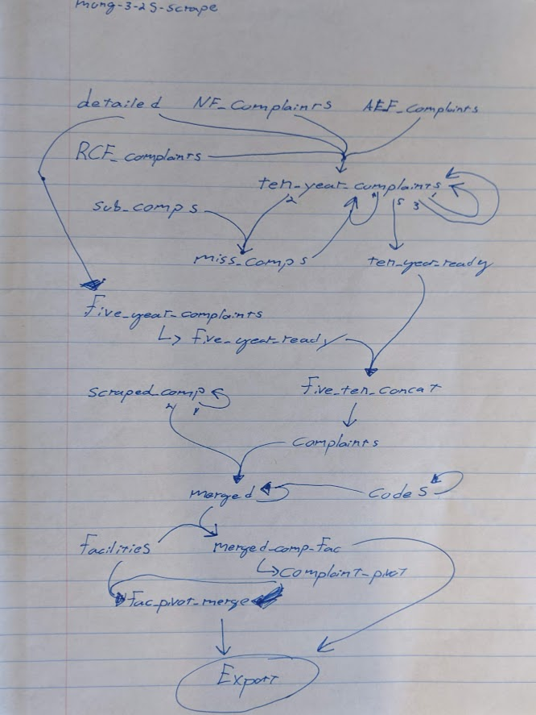

# Long-term Care Complaints Data and Analysis

This repo includes the data and code that support ten 
passages from the story "Kept in the Dark" (www.oregonlive.com/senior-care), published online on oregonlive.com on April 21, 2017 and in print on April 23.

Below are passages from the story and links to the code that substantiates them. The [data](https://github.com/TheOregonian/long-term-care-db/blob/master/data), [notebooks](https://github.com/TheOregonian/long-term-care-db/blob/master/notebooks) and [scraper](https://github.com/TheOregonian/long-term-care-db/blob/master/scraper) folders have their own README files, if you'd like more details.

## Steve's Notes

## Analyses

- __Passage__: "...state officials have excluded nearly 8,000 substantiated complaints of 
substandard care from the state’s website."
- __Analysis__: [This notebook](https://github.com/TheOregonian/long-term-care-db/blob/master/notebooks/analysis/complaints-analysis.ipynb).

***

- __Passage__: "More than 60 percent of the substantiated complaints against care centers in Oregon since 2005 
can’t be found on the state’s website."
- __Analysis__: [This notebook](https://github.com/TheOregonian/long-term-care-db/blob/master/notebooks/analysis/complaints-analysis.ipynb).

***

- __Passage__: "But the state website did not reveal the 10 times that Washington Gardens had been hit with 
substantiated findings of abuse, neglect or poor care."
- __Analysis__: [This notebook](https://github.com/TheOregonian/long-term-care-db/blob/master/notebooks/analysis/washington-gardens.ipynb).

***

- __Passage__: "About 600 nursing homes and other senior care centers around Oregon have incomplete records online, 
The Oregonian/OregonLive’s analysis found."
- __Analysis__: [This notebook](https://github.com/TheOregonian/long-term-care-db/blob/master/notebooks/analysis/facilities-analysis.ipynb).

***

- __Passage__: "Just 9 percent of residential care centers, assisted living facilities and nursing homes had 
accurate records online. 

   Of the 642 facilities open as of late last year, 583 had incomplete records at the time of the analysis. Of those, about 350 had 
   more than double the number of complaints shown on the state’s website. Fifty-nine care centers falsely appeared to have perfect 
   records. Just like Washington Gardens, they had zero complaints online. In reality, none of these places were complaint-free. 

   In all, facilities with incomplete records have the combined capacity to serve 
   more than 35,000 people."
- __Analysis__: [This notebook](https://github.com/TheOregonian/long-term-care-db/blob/master/notebooks/analysis/facilities-analysis.ipynb).

***

- __Passage__: "At Pacific Gardens Alzheimer’s Special Care Center in 2015, caregivers made more than 70 medication 
mistakes in four months, investigators found, resulting in 17 official findings against the facility. The pattern 
prompted the state to demand a “plan of action” from Pacific Gardens. 

   But only one of the state findings is online: a resident who received another person’s medication and became sedated. The other 
   16 cases ended with no visible harm and are hidden from website visitors."
- __Analysis__: [This notebook](https://github.com/TheOregonian/long-term-care-db/blob/master/notebooks/analysis/pacific-gardens.ipynb).

***

- __Passage__: "Complaints labeled “potential for harm” or “no negative outcome” account for about 2,500 of the 
substantiated complaints that are missing from the website, or around 30 percent of the records that have been kept offline. The 
state fined the facilities in hundreds of those cases."
- __Analysis__: [This notebook](https://github.com/TheOregonian/long-term-care-db/blob/master/notebooks/analysis/complaints-analysis.ipynb).

***

- __Passage__: "For example, state records show there were at least 11 thefts from residents at Emeritus at Springfield-The Woodside, 
an assisted living facility, in a three-month period in 2013. One resident reported missing $300. In each case, the state faulted the
facility for failing to provide a safe environment for residents, a violation of Oregon’s long-term care regulations. None of these 
substantiated complaints are on the state’s website. 
   
   None of these substantiated complaints are on the state’s website. 

   Yet very similar complaints -- made in the same year, against a care center with the same owners, and located in the same city -- 
   are all online. 

   Search the state website for “Emeritus at Springfield-The Briarwood,” and you’ll find records corresponding to thefts 
   of two fishing poles, tackle boxes and $370 in cash."
- __Analysis__: [This notebook](https://github.com/TheOregonian/long-term-care-db/blob/master/notebooks/analysis/emeritus-springfield-woodside-and-briarwood.ipynb).

***

- __Passage__: "Of the roughly 650 care centers licensed in Oregon, more than a quarter have complaints that can be found only
under their previous names."
- __Analysis__: [This notebook](https://github.com/TheOregonian/long-term-care-db/blob/master/notebooks/analysis/facilities-analysis.ipynb).

***

- __Passage__: "River Grove Memory Care in Eugene, for example, shows four complaints racked up since the current owners bought 
it in 2015. However, searching for the home under three of its previous names and owners shows an additional 31 complaints. 
Seventeen of those happened in the two years before the current owners took over. 

   It would take a thorough knowledge of the home’s history to find them. River Grove used to be Santa Clara Special Care Community.
   Before that, Sierra Oaks of Santa Clara. Before that, Santa Clara Residential Inn."
- __Analysis__: [This notebook](https://github.com/TheOregonian/long-term-care-db/blob/master/notebooks/analysis/river-grove-memory-care.ipynb).

## Technical Notes

To re-run the analyses above, you'll need Python 3.X, as well as the Python libraries 
listed in [requirements.txt](https://github.com/TheOregonian/long-term-care-db/blob/master/requirements.txt).

## Feedback

If you have questions or feedback about the data or analyses, contact Fedor Zarkhin 
at [fzarkhin@oregonian.com.](fzarkhin@oregonian.com)

## License

[MIT](https://github.com/TheOregonian/long-term-care-db/blob/master/LICENSE)
